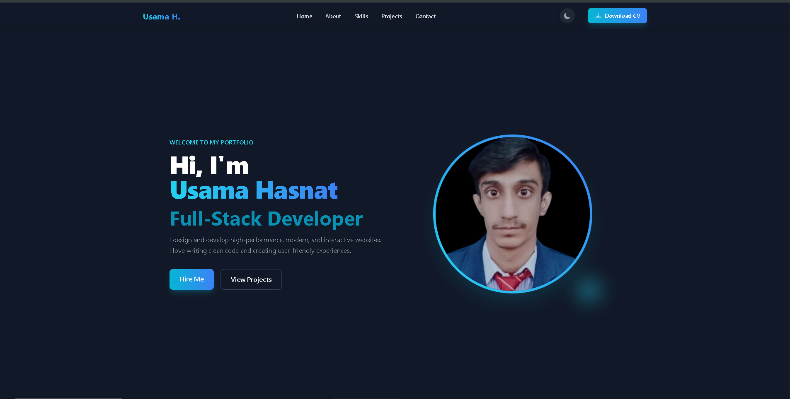

# 💼 Personal Portfolio — Usama Hasnat

A modern, responsive, and interactive personal portfolio website built to showcase my skills, projects, services, and professional profile as a Full-Stack Developer, Software Developer, WordPress Developer, Graphic Designer, and UI/UX Designer.

This portfolio combines modern web development with clean UI design to create a professional digital presence where visitors can explore my technical skills, featured projects, design capabilities, and ways to connect with me.

---

## 🌐 Live Demo

👉 **[View Live Portfolio](https://YOUR-VERCEL-URL.vercel.app/)**

📸 Preview



---

## ✨ Features

* 👨‍💻 Professional Hero Section
  
  * Introduces me as a Full-Stack Developer, Software Developer, WordPress Developer, Graphic Designer, and UI/UX Designer.
  * Includes an animated typewriter effect for displaying professional roles.
  * Provides clear call-to-action elements for exploring the portfolio.

* 👤 About Me
  
  * Provides an introduction and professional overview.
  * Highlights my passion for development, software, WordPress, and digital design.
  * Presents my approach to creating modern and user-friendly digital experiences.

* 🛠️ Skills & Technologies
  
  * Displays frontend, backend, WordPress, design, and development tools.
  * Uses technology icons for a clean and visual presentation.
  * Organizes technologies into dedicated categories for easier navigation.

* 🎨 Frontend Development
  
  * HTML5
  * CSS3
  * Tailwind CSS
  * JavaScript
  * React.js
  * Bootstrap

* ⚙️ Backend Development
  
  * C#
  * .NET
  * Node.js
  * Express.js
  * PHP

* 🌐 WordPress Development
  
  * WordPress website development
  * Customization and styling
  * Responsive WordPress interfaces

* 🎨 Graphic & UI/UX Design
  
  * Figma
  * Canva
  * User interface design
  * Responsive visual layouts
  * Modern design concepts

* 💻 Featured Projects
  
  * Showcases selected projects in responsive project cards.
  * Includes project screenshots and descriptions.
  * Provides Live Demo links for deployed projects.
  * Provides GitHub Code links for source repositories.

* 🖼️ Project Screenshots
  
  * Displays visual previews of featured projects.
  * Uses responsive image containers for clear project presentation.
  * Includes hover effects and smooth image transitions.

* 🌙 Dark & Light Mode
  
  * Provides a modern dark interface.
  * Supports light mode for improved accessibility and user preference.
  * Uses smooth color transitions between themes.

* 📱 Responsive Design
  
  * Fully responsive across desktop, tablet, and mobile devices.
  * Uses responsive layouts and spacing.
  * Provides mobile-friendly navigation and content sections.

* ✨ Modern UI Effects
  
  * Smooth hover animations.
  * Gradient accents.
  * Interactive buttons.
  * Card hover effects.
  * Smooth transitions throughout the interface.

* 📊 GitHub Statistics
  
  * Displays GitHub profile information.
  * Includes GitHub streak statistics.
  * Includes profile view statistics.
  * Highlights GitHub activity and development consistency.

* 🔗 Social Media Integration
  
  * GitHub profile connection.
  * LinkedIn profile connection.
  * Instagram profile connection.
  * Provides visitors with multiple ways to connect.

---

## 🛠️ Tech Stack

| Technology | Purpose |
| ------------------ | -------------------------------------------------------------------------------------------------------------------------------- |
| HTML5 | Website structure, semantic content, sections, navigation, forms, and project layouts |
| CSS3 | Custom styling, visual effects, transitions, and responsive presentation |
| Tailwind CSS | Responsive layouts, typography, spacing, colors, components, dark mode, and animations |
| JavaScript | Interactive functionality, UI behavior, navigation, theme switching, animations, and dynamic interactions |
| React.js | Frontend development knowledge and component-based application development |
| Bootstrap | Responsive UI components and frontend development |
| C# | Backend and software development |
| .NET | Backend application and software development |
| Node.js | Server-side JavaScript development |
| Express.js | Backend and API development |
| PHP | Server-side web development |
| WordPress | Content management and WordPress website development |
| Figma | UI/UX design, wireframes, and interface design |
| Canva | Graphic design and visual content creation |
| Git | Version control and project management |
| GitHub | Source code hosting and repository management |
| VS Code | Development environment and code editing |

---

## ⚙️ How It Works

1. Open the personal portfolio website.
2. Explore the hero section and professional introduction.
3. Navigate through the About Me section.
4. Explore my development and design skills.
5. Browse the featured projects section.
6. View project screenshots and descriptions.
7. Open available projects through their Live Demo buttons.
8. Visit project source code through GitHub Code links.
9. Explore GitHub statistics and development activity.
10. Use the social links to connect through GitHub, LinkedIn, or Instagram.

---

## 🎯 Project Highlights

This portfolio focuses on creating a professional and modern developer presence while implementing:

* Responsive portfolio layout
* Modern hero section
* Animated typewriter effect
* Professional About Me section
* Frontend skills showcase
* Backend skills showcase
* WordPress development showcase
* Graphic design showcase
* UI/UX design showcase
* Technology icon integration
* Featured project cards
* Project screenshots
* Live Demo links
* GitHub repository links
* Dark mode
* Light mode
* Smooth theme transitions
* Responsive navigation
* Mobile-friendly interface
* Hover animations
* Gradient UI elements
* Responsive project grid
* GitHub statistics
* Profile view counter
* GitHub streak statistics
* Social media integration
* Modern responsive UI
* Clean component-style structure
* Cross-device compatibility

---

## 📂 Project Structure

```text
my-personal-portfolio/
│
├── index.html
│
├── Js/
│   └── script.js
│
├── assets/
│   ├── personal portfolio.png
│   ├── nexora online store.png
│   ├── glassmorphic form builder.png
│   ├── secure password vault generator.png
│   ├── project-5.png
│   ├── project-6.png
│   └── personal-portfolio.png
│
└── README.md

```

## 👨‍💻 Author

**Usama Hasnat**

Full-Stack Developer • Software Developer • WordPress Developer • Graphic Designer • UI/UX Designer

This portfolio was created to showcase my development projects, technical skills, software development knowledge, WordPress experience, and creative design work.

---

⭐ If you like this project, consider giving the repository a star!
